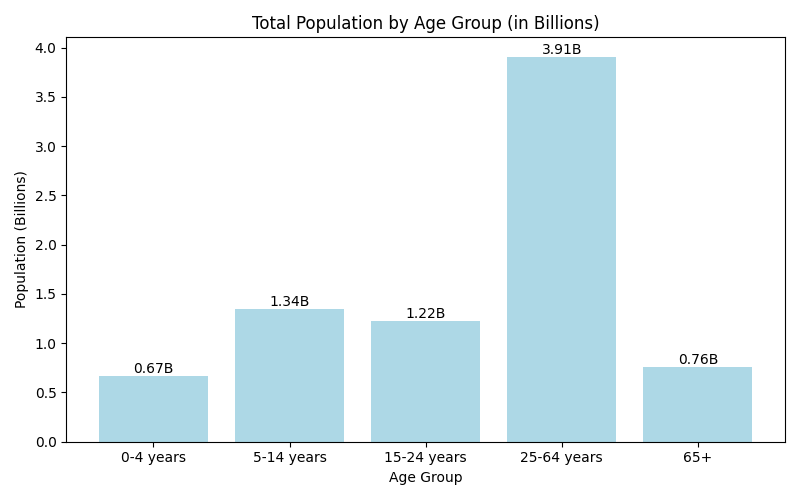

# Task 1: Population Age Group Visualization

This project is part of a data visualization task using Python and Matplotlib.

## 📊 Objective

Visualize the distribution of a continuous variable — specifically, the **population distribution across age groups** — using a **bar chart**.

## 📁 Dataset

The dataset used (`dataset.csv`) contains population data categorized by:

- Country
- Total population
- Age groups:
  - 0–4 years
  - 5–14 years
  - 15–24 years
  - 25–64 years
  - 65+

## 🛠️ Technologies Used

- Python
- Pandas
- Matplotlib

## 📌 Output

A bar chart showing the **total population by age group**, with the Y-axis representing the values in **billions** for better readability.



## 🚀 How to Run

1. Clone this repo
2. Ensure `dataset.csv` is in the same directory
3. Run the script:

```bash
python script.py
```

## 📈 Result
1. Provides a clear view of how population is distributed across different age brackets.
2. Useful for demographic analysis and planning.

## ✅ Task Completed
  ✔️ Created a bar chart to visualize the distribution of age groups in a population.
